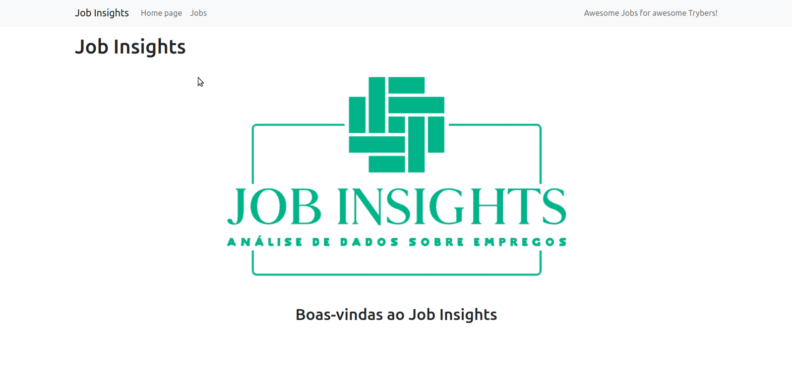

# About the project / *Sobre o projeto*

This project is based on the implementation of analysis from a set of employment data. These implementations are built into a web application powered by Flask (a very popular web framework in the Python community). This project also included some tests to ensure quality, security and cost reduction in code production. Data were extracted from the website [Glassdoor](https://www.glassdoor.com.br/) and obtained through [Kaggle](https://www.kaggle.com/atharvap329/glassdoor-data-science-job -data), a platform that makes datasets available to data scientists.

---

*Este projeto é baseado em implementação de análises a partir de um conjunto de dados sobre empregos. Essas implementações são incorporadas a um aplicativo Web desenvolvido com Flask (um framework web muito popular na comunidade Python). Nesse projeto também foram incluídos alguns testes para assegurar a qualidade, segurança e redução de custos na produção do código. Os dados foram extraídos do site [Glassdoor](https://www.glassdoor.com.br/) e obtidos através do [Kaggle](https://www.kaggle.com/atharvap329/glassdoor-data-science-job-data), uma plataforma que disponibliza conjuntos de dados para cientistas de dados.*

---
# Skills / *Habilidades*

  - Python programming / *Programação em Pyhton*
  - Python iterative terminal / *Terminal interativo do Python*
  - Conditional and repeating structures / *Estruturas condicionais e de repetição*
  - Built-in functions from Pyhton / *Funções embutidas do Python*
  - Exceptions treatments / *Tratamento de exceções*
  - Files manipulation / *Manipulação de arquivos*
  - Python functions / *Funções em Python*
  - Tests in Pyhton / *Testes em Python*
  - Write and import modules / *Escrever e importar módulos*

---
# Layout

---
# Deployment / *Implantação*

See it in action/ **Veja em ação**: [https://kelsonbatista.github.io/project_pyhton_job_insights/](https://kelsonbatista.github.io/project_pyhton_job_insights/)

Commands:

- docker-compose up -d
- Access http://localhost:5000
